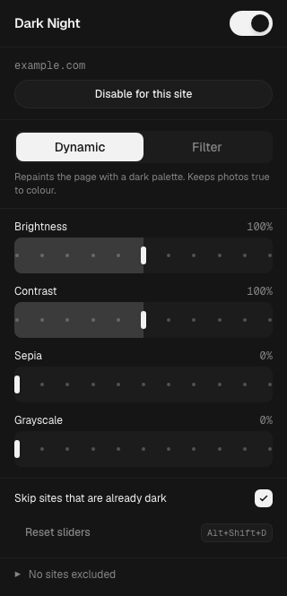
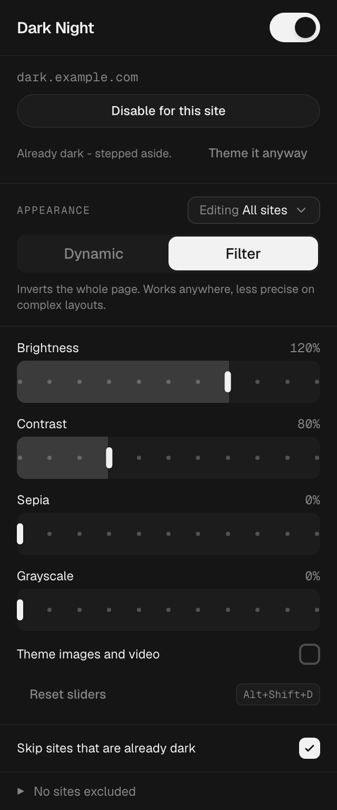
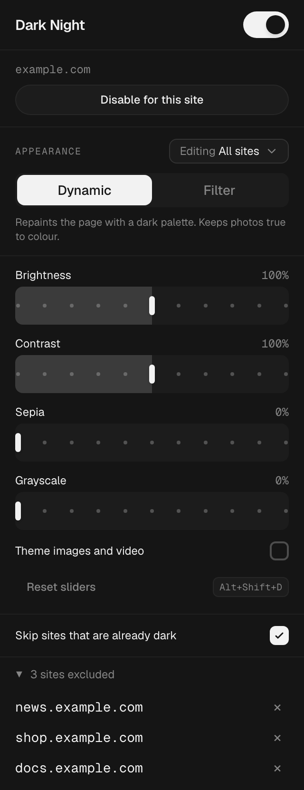

# Dark Night

A Manifest V3 Chrome extension that applies a dark theme to any website.

<p>
  
  
  
</p>

## Privacy

Dark Night runs entirely on your device. It has no server, no analytics, no telemetry, and no
account - there is nothing for it to phone home to. Settings live in `chrome.storage`, synced
only through your own browser's built-in sync, never through infrastructure of ours.

It is also fully open source: every line that touches your browser - the theming engine, the
popup, the background worker - is in this repository, so you can read exactly what it does
instead of taking a store listing's word for it. A lot of "free" dark-mode extensions pay for
themselves by injecting scripts or reselling browsing data; Dark Night has no mechanism to do
either, by design.

## Install

The popup is a React bundle, so it has to be built before Chrome can load it.
`popup/dist/` is generated and git-ignored - a fresh clone will not have it.

```bash
npm install && npm run build
```

1. Open `chrome://extensions`
2. Enable **Developer mode**
3. **Load unpacked** -> select this folder

Re-run `npm run build` after any change under `popup/src/`. `npm run dev` rebuilds on save;
there is no dev server, because MV3 forbids remote code and the extension always loads the
built bundle.

`test/` and `popup/src/` are development-only; Chrome ignores them.

## Design system

The popup is built from a small set of motion-driven components (`popup/src/components/motion/`) -
not reimplementations bolted onto stock HTML elements:

| Surface | Component |
| --- | --- |
| Master toggle | `Switch` - spring thumb, `stiffness 800 / damping 80 / mass 4`, squish on press |
| All sites / This site | `Tabs` (segment) - the same control as the engine picker, so "which settings am I editing" reads the same way as "which engine is on" |
| Dynamic / Filter | `Tabs` (segment) - `layoutId` indicator on a `170 / 24 / 1.2` spring |
| The four sliders | `RangeSlider` - `role="slider"`, tick dots per step, glide-tracked fill |
| Site and reset actions | `Button` - press-scale feedback |
| Theme images, skip already-dark sites | `Checkbox` - draw-on checkmark, spring press |
| Slow-load placeholder | `TextShimmer` - only if the settings read exceeds 120ms |

The palette is copied verbatim into the stylesheet rather than eyeballed.
`popup/src/theme.css` holds the `:root` and `.dark` blocks; `content.js` mirrors the dark set
in a `T` constant, so a themed web page and the extension's own UI are the same colours:

| Token | Dark value | Used for |
| --- | --- | --- |
| `--background` | `#151515` | page and popup ground |
| `--card` | `#1c1c1c` | raised surfaces, inputs, hover |
| `--foreground` | `oklch(96% 0 0)` | body text, remapped icon fills |
| `--muted-foreground` | `oklch(62% 0 0)` | secondary text, placeholders |
| `--border-strong` | `#ffffff1a` | hairlines, elevation ring |
| `--accent` | `oklch(80% 0.18 195)` | links, focus ring, selection |
| `--violet` | `oklch(68% 0.22 295)` | visited links |

A test asserts the injected sheet contains *only* these values, so the two can never drift.
In filter mode the root paints `#eaeaea`, which inverts to exactly `#151515`.

Geist is the popup's typeface and is bundled - one variable file per family, vendored into
`popup/src/fonts/` because MV3 forbids remote resources and `node_modules` is not committed.
SIL Open Font License 1.1; the licence travels with the fonts.

## Use

| Control | What it does |
| --- | --- |
| Toolbar toggle | Master on/off. |
| `Alt+Shift+D` | Same toggle, from the keyboard. |
| Disable for this site | Per-site opt-out. Matches subdomains, and ignores a leading `www.` |
| All sites / This site | Which set of settings the controls below it are editing (below). |
| Dynamic / Filter | The two theming engines (below). |
| Sliders | Brightness, contrast, sepia, grayscale - applied in both engines. Stepped in 10s, so the slider draws a tick per step (it stops drawing them past 50 steps, which a finer step would exceed). |
| Theme images and video | Off by default: photos, video and plugin surfaces keep their real colours (below). |
| Skip sites that are already dark | On by default. A page that is already rendering dark - its own toggle, a stored preference, a `prefers-color-scheme` theme - is left alone (below). |
| Theme it anyway | Shown when the extension stepped aside on the current site; overrides the detection for that site permanently. `Step aside` undoes it. |
| Excluded sites | The list at the bottom of the popup removes an opt-out without visiting the site. |

**Opening the popup never animates anything in.** Rendering with defaults and snapping to
the stored values is a visible jump, so nothing is drawn until the values are known - and
because a storage read is normally a few milliseconds, the shimmer placeholder only appears
if that read passes 120ms. Only *exits* animate; a frozen exit merely leaves content on
screen, whereas a frozen entrance leaves it invisible.

The toolbar icon is never decorated - no badge, no overlay. State is answered by the
popup, which is where it is legible.

When the current site is excluded by a *parent* domain rule, the button says
`Enable example.com` rather than `Enable for this site` - removing that entry re-enables
every subdomain under it, so it says so instead of doing it silently.

Settings live in `chrome.storage.sync`, so they follow the Chrome profile across devices.
Slider drags are coalesced into one write; every other control writes immediately. If a
write is ever rejected the popup reverts to what is actually stored and says so, rather
than showing a state that was never saved.

## A site's own settings

Some sites need a different engine or a different brightness than the rest of the web, and
tuning for one of them should not retune every other. The `All sites` / `This site` picker
decides which set an edit lands in: the engine, the four sliders and the image rule, saved
either once for everything or separately for the host in front of you.

Switching to `This site` shows the shared values until the first edit, which is what
snapshots them into the site's own set - all six at once, never a partial copy. A partial
one would silently follow later changes to the shared settings for whichever keys it
happened not to hold, which is not what "only for this site" means. `Clear site settings`
removes the set and drops the site back to the shared values; the popup then reopens in
`All sites`, because a scope with nothing in it is not a state worth showing.

A site that has its own settings opens showing them, rather than showing values the page in
front of you is not being painted with. From `All sites` the hint says so, so the set is
never invisible.

The match is the exact host - `docs.example.com` does not inherit what `example.com` was
tuned to. That is the opposite of the exclusion list, deliberately: excluding a domain is
meant to cover everything under it, whereas a tuning is a response to one site's design.
Only the visual settings are per-site. The master switch, the exclusion list and auto-skip
stay shared, because they decide *whether* to theme and already have per-site answers.

## Images

Off by default, images, video, `<embed>` and `<object>` keep the colours the site shipped.
That is not free: there is no way in CSS to exempt anything from an ancestor's filter, so
media instead carries the exact reverse of the root filter and comes out of the pair
unchanged. Reversing a chain reverses its order as well as each function, and brightness
and contrast do not commute, so the order is load-bearing:

| Root applies | Media carries |
| --- | --- |
| `brightness(b)` | `brightness(1/b)` |
| `contrast(c)` | `contrast(1/c)` |
| `grayscale(g)` | `saturate(1/(1-g))` - exact, because the spec defines `grayscale(g)` as `saturate(1-g)` |
| `sepia(s)` | nothing - see below |
| `invert(1) hue-rotate(180deg)` | itself; the pair is its own inverse |

`sepia()` is the one function with no inverse among the CSS filters, and at 100% its matrix
is singular anyway, so a sepia tint still reaches media. Dropping a term from the middle of
a chain also costs a little more than that term - the reversal telescopes only while it
stays paired - so with sepia in play grayscale stops cancelling exactly either. At the
default sepia of 0, every term cancels exactly.

Two properties are asserted rather than asserted-to-be-obvious, both in `test/harness.html`:
the composed matrices land on the identity to within `1e-9`, and - modelling the clamp to
`[0, 1]` that a browser applies between filter primitives, which the matrix maths omits -
the reversal never leaves a channel further from its true colour than no reversal would
have, and is exact for every channel the root filter had not already clipped. What clipping
costs is a highlight the root filter destroyed before the media rule was reached; at
brightness 50 / contrast 60, white is simply gone, and no element filter recovers it.

Turning the setting on hands media straight to the root filter instead, which in filter mode
means it inverts along with the page. That is the point of it - a screenshot or a diagram
with a white background becomes readable - and an inverted photograph is why it is off until
asked for. Fullscreen media is handled the other way round in both cases: it sits in the top
layer, outside the `<html>` subtree, so the root filter never reaches it, and it needs
nothing while true to colour and the whole treatment applied directly when themed.

`<canvas>` and `<iframe>` are excluded from all of this for the reasons already in
`content.js`: a canvas is as often an application surface as a picture, and re-filtering an
iframe cancels the root filter for frames the content script cannot enter.

## Native dark detection

"Does this site offer dark mode" is not answerable from a content script - cross-origin
stylesheets hide their rules - but "is this page rendering dark right now" is. Once the
page has real styles (DOMContentLoaded, re-checked at 1s and 3s for late-hydrating SPAs),
the content script lifts its own stylesheet, reads the page's background colour, and
restores it - one synchronous task, so the unthemed frame is never painted. The pre-paint
sheet (`early.css`) is released *before* detection is armed: it paints `<html>` dark, and
on a light site with a transparent `<body>` - which has nothing else to measure - the
engine would otherwise read that colour and switch itself off on a white page. If the page
measures dark (relative luminance, with `oklch`/`lab` and `color-scheme` fallbacks), the
theme steps aside for that load and the popup says so.

Colours are classified from the computed value in whatever notation Chrome hands back:
legacy `rgb()`/`rgba()`, `color(srgb …)` (what `color-mix(in srgb, …)` and relative colour
syntax compute to), and `oklch`/`oklab`/`lab`/`lch` (what Tailwind 4 emits). A background
that is see-through in *any* of those notations is "cannot tell", not dark - a faint
`bg-black/10` tint on `<body>` computes to `oklab(0 0 0 / 0.1)`, and reading it as opaque
black switched the engine off on a white page.

Only the top frame measures; subframes follow its verdict over `postMessage`, because in
filter mode a subframe's CSS assumes the top frame's filter exists and frames must agree.

The verdict is never a stored *decision* - nothing is written to the exclusion list, so a
site that later drops its dark theme is themed again automatically. It is remembered as a
*hint*, per host in `chrome.storage.local`: the first measurement cannot happen before
DOMContentLoaded, while the theme goes on as soon as the settings read resolves, and in
filter mode that gap put `invert(1)` over a self-theming dark site and rendered it white on
every visit. The remembered verdict seeds that gap; the measurement still runs and overrules
it in either direction, so a stale hint costs one load, not a wrong state. Two settings
control the feature itself: `autoSkipNativeDark` (the popup switch, default on) and
`forcedSites` ("Theme it anyway", per site).

One case is deliberately not a miss: if the browser prefers light and the site only goes
dark via `prefers-color-scheme`, the page really is rendering light, and theming it is the
correct outcome. A content script cannot spoof the media query to find out what the site
*would* do.

## The two engines

**Dynamic** (default) overrides colors with a dark palette: backgrounds, text, links,
form controls, selection, placeholders and scrollbars. Images and video are untouched.
Hover and selected states get their own surfaces, so the UI still responds visually.

Every selector carries a `:not(#\9)` specificity booster. `#\9` is an id made of a tab
character and HTML forbids whitespace in an id, so it matches nothing and only raises
specificity to `(3,0,0)`. Without it a bare `*` loses to any site rule like
`.card { background: #fff !important }` and that surface stays white - which was the most
common reason a themed page still looked untouched.

The sheet is also adopted into every open shadow root, because a `<style>` in `<head>`
does not cross a shadow boundary and `background-color` does not inherit. Without that,
component-based apps kept their light surfaces.

Every frame emits this sheet, with one exception: the slider filter on `<html>` is emitted
only in the top frame. A filter on `<html>` rasterises the whole subtree, and an iframe's
painted output is part of that subtree, so a subframe emitting its own copy had the sliders
applied twice - brightness 130 landing on 169, and compounding again per nesting level.
Filter mode has always gated its root rule this way. The media reversal is *not* gated, and
must not be: the top frame's filter still reaches a subframe's media, so it still needs the
same single reversal.

**Filter** applies `invert(1) hue-rotate(180deg)` to the page and re-inverts images, video
and embedded content so photos keep their real colors. It handles any site uniformly but is
less precise on complex layouts.

Two things are deliberately *not* re-inverted:

- **iframes.** The top frame's filter already inverts every subframe's painted output, so
  re-inverting the element cancelled it out and any frame the content script cannot enter
  (sandboxed without `allow-scripts`, an injection that failed) rendered as a bright white
  box. Subframes now apply only their own media re-inversion, which also stops the sliders
  compounding once per nesting level.
- **canvas.** A canvas is as often an application surface - a spreadsheet grid, a document
  view, a whiteboard - as it is a picture, and re-inverting it left those apps white on an
  otherwise dark page.

Filter mode also pins `color-scheme: light`, so a site that would otherwise serve its own
dark theme serves the light one this engine is built to invert, and gives top-layer elements
(modal dialogs, open popovers, fullscreen) their own filter pass - they are painted outside
the `<html>` subtree, so the root filter never reached them and they stayed white.

## Files

| File | Role |
| --- | --- |
| `manifest.json` | MV3 manifest - `storage` + `scripting` permissions, content script on all URLs and frames |
| `content.js` | Theme engine: builds the stylesheet, keeps it applied, reacts to setting changes |
| `background.js` | Service worker: keyboard shortcut, pre-paint CSS registration, injection into open tabs |
| `early.css` | Pre-paint dark background that prevents the white flash on page load |
| `popup/src/` | Popup source: React app, motion-driven UI components, theme |
| `popup/src/fonts/` | Geist variable fonts, vendored with their licence |
| `popup/dist/` | Built popup - generated, git-ignored, what the manifest points at |
| `vite.config.ts` | Build: React + Tailwind 4, relative asset paths for `chrome-extension://` |
| `components.json` | shadcn CLI config (aliases, Tailwind paths) for the popup's components |
| `test/` | Test harnesses and visual test page |

## Tests

Serve the folder and open the harness - it loads the real `content.js` against a mocked
`chrome` API and asserts on generated CSS and computed styles.

```bash
python3 -m http.server 8765
```

| URL | Covers |
| --- | --- |
| `localhost:8765/test/harness.html` | 131 assertions: both engines, specificity, shadow DOM (including a real custom-element upgrade), frames, top layer, sliders, toggles, per-site rules and per-site themes, which rules a subframe emits and which it leaves to the top frame, liveness-poll gating, self-heal, host matching - and the media reversal, checked as arithmetic: the filter functions are re-implemented as affine maps and the composed chain must land on the identity |
| `localhost:8765/test/harness.html?suite=pending` | A settings write landing between the initial storage read and its callback |
| `localhost:8765/test/harness.html?suite=nativedark` | 43 assertions: the colour classifier across every notation and its alpha handling, stepping aside on an already-dark page, the scheduled recheck catching a page that flips, `forcedSites`, the auto-skip toggle, and what gets remembered |
| `localhost:8765/test/harness.html?suite=earlycss` | 8 assertions: detection against the **real** `early.css` on a light page with a transparent `<body>` - the pre-paint sheet must be released before the first measurement, or the engine reads its own dark colour and switches off on a white page |
| `localhost:8765/test/harness.html?suite=hint` | 8 assertions: a remembered verdict seeds the load before the settings arrive, and a stale one is corrected by the measurement rather than believed |
| `localhost:8765/test/harness.html?suite=invalidated` | 7 assertions: the frame reclaiming itself when the extension is reloaded out from under it. The scheduled rechecks reach `chrome.storage` at 1s and 3s, well inside the 5s liveness poll - and on a page the engine stepped aside from that poll is not running at all |
| `localhost:8765/test/perf-bench.html` | Style-resolution cost of the real dynamic sheet on a ~9,500-element DOM, and a guard on the specificity booster: it must stay cascade-identical to the chained form and beat it head-to-head |
| `localhost:8765/test/popup-harness.html` | 111 assertions: the **built** React popup against a mocked `chrome`, including UI component wiring, rejected writes, external changes, corrupt settings, the scope picker and what an edit in each scope does and does not move, the image toggle, and the native-dark banner with its parent-rule disclosure and policy re-query |
| `localhost:8765/test/worker-harness.html` | 32 assertions: the real `background.js` driven as a black box against a mocked MV3 surface - registration lifecycle, badge clearing, tab adoption, the shortcut, host matching, corrupt storage |
| `localhost:8765/test/test.html?mode=dynamic\|filter\|off` | Visual page with the layout patterns that commonly break dark-mode extensions |

The content and worker harnesses cache-bust their source; the popup harness loads
`popup/dist`, whose filenames are content-hashed. Run `npm run build` before the popup suite -
a stale bundle is the one failure mode that makes it lie.

Nothing in these suites touches a real Chrome. They mock the extension APIs, so they prove
logic, CSS and wiring - not that Chrome accepts the manifest. Load the unpacked extension to
confirm that.

## Known limitations

- **Dynamic mode drops CSS background images on elements** (gradients, hero images, sprite
  icons set via `background-image`). Without this, a light gradient survives the color
  override and leaves near-white text on a near-white band. Sprite icons on `::before` /
  `::after` are preserved. Filter mode keeps all backgrounds.
- **Dynamic mode no longer repaints `::before` / `::after` backgrounds**, so a pseudo-element
  the site uses as a full-bleed light overlay stays light. Painting them dark instead turned
  every accent bar, tooltip arrow and toggle knob into an opaque block, which was worse;
  distinguishing the two needs per-rule color analysis, not a static sheet.
- **An `<embed>` or `<object>` *document* (a PDF) stays light in filter mode.** Both are
  treated as media so plugin and image content keeps its real colors. An `<iframe>` PDF is
  themed correctly.
- **Dynamic mode uses a flat palette** rather than per-rule color analysis, so sites
  lose color hierarchy between surfaces. Non-table borders keep their original color, so
  some light dividers stay visible; remapping them correctly needs per-element computed
  style inspection, and a blanket `border-color` rule squares off CSS-triangle carets.
- **Inline `style="... !important"` still wins.** That is author-important at style-attribute
  level, which outranks any selector-based rule, so no specificity booster can reach it.
- **Closed shadow roots are unreachable**, by design of the platform. Open roots are themed.
- **Photographic canvases render inverted in filter mode** - the cost of treating canvas as
  an application surface. Use dynamic mode, or exclude the site.
- **Filter mode inverts `position: fixed` layering** on some sites, and moving a slider in
  dynamic mode applies a filter to `<html>`, which makes it a containing block for fixed
  elements. Both are inherent to CSS filters.
- **Native dark detection reads the rendered page, not the site's intent.** A dark splash
  screen or hero can step the theme aside for a load until a recheck corrects it, and a
  site whose dark theme only exists behind `prefers-color-scheme` while the browser prefers
  light is - correctly - treated as a light page. `Theme it anyway` overrides per site.
- Chrome blocks content scripts on `chrome://` pages, the Web Store, and other extensions'
  pages, so those always stay light. The popup says so instead of offering a toggle that
  would do nothing.
